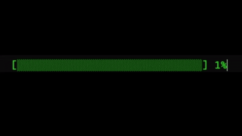

# ⏳ Terminal Loading Bar (Python)

A fun little Python project that shows a realistic loading bar in the terminal.  
It uses Unicode block characters and ANSI escape codes to animate a smooth, natural-looking progress bar.  

## Features
- Realistic uneven speed (slow start, faster middle, slow finish)  
- Fully green block bar (no color switching)  
- Simple, single-file script (loading_bar.py)  
- Works on most terminals (Linux, macOS, Windows Terminal, VS Code)  

## Demo

Example Output:
[██████████--------------] 40%

## Usage
1. Clone the repository
   git clone https://github.com/<your-username>/Loading_Bar.git
   cd Loading_Bar

2. Run the script
   python loading_bar.py

## Project Structure
Loading_Bar/
│── loading_bar.py  
│── README.md  
└── loading.gif  

## Contributing
Found a bug or want to make the animation cooler?  
Feel free to open an issue or a pull request 🚀  

## License
This project is licensed under the MIT License – free to use, modify, and share.  

Made with Python and a little creativity ✨
